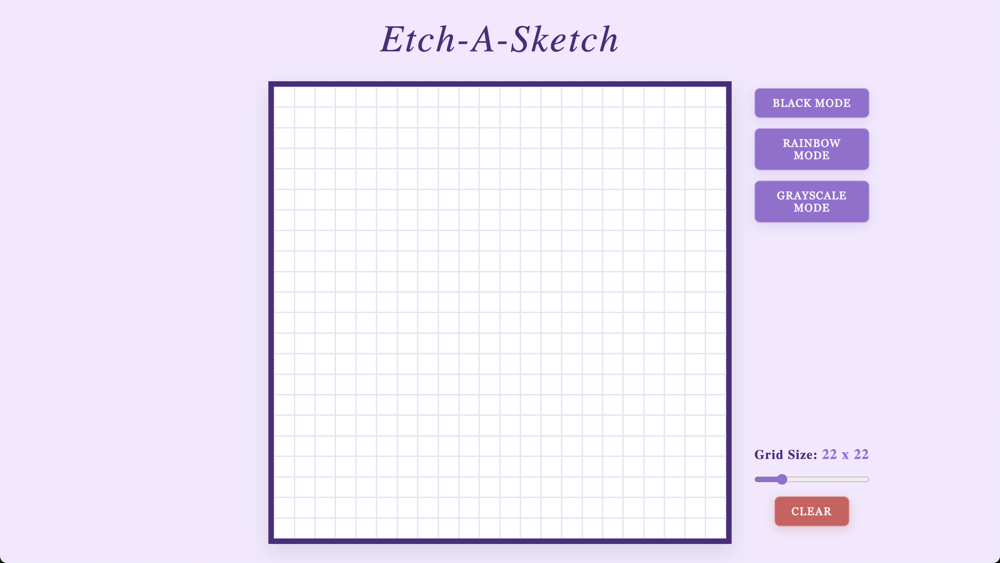

# 🎨 Etch-A-Sketch

An interactive Etch-A-Sketch web application built using vanilla JavaScript.  
This project focuses on DOM manipulation, event handling, and responsive layouts.

## Live Demo

Live Preview: https://inaladevi.github.io/etch-a-sketch/

## Features

- Dynamic grid generation (1×1 up to 100×100)
- Adjustable grid size using a slider
- Multiple drawing modes:
  - Black mode
  - Rainbow (random RGB) mode
  - Grayscale mode with progressive darkening
- Clear button to reset the canvas
- Responsive design that maintains a fixed drawing area

## Built With

- HTML5
- CSS3 (Flexbox, responsive units)
- JavaScript 

## 🖼️ Preview

